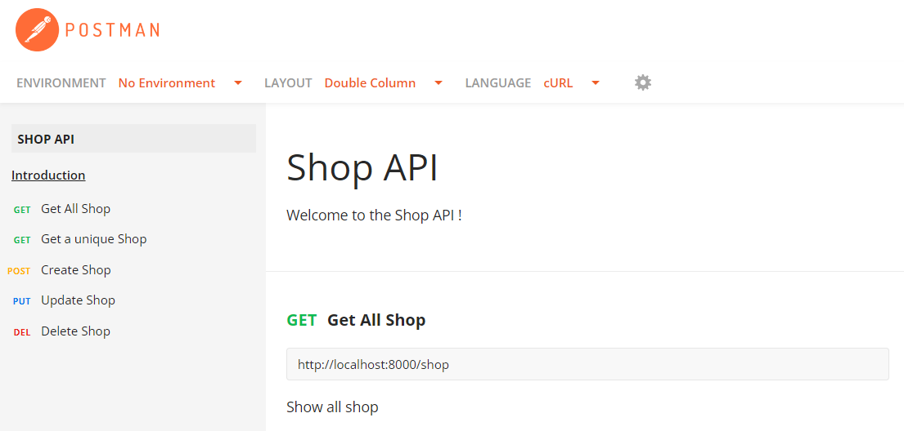

<div id="top"></div>
<div align="right">

</div>
<!-- PROJECT LOGO -->
<br />
<div align="center">
  <h1 align="center">API_Shop</h1>
</div>

<!-- ABOUT THE PROJECT -->
## About The Project
<br />
<div align="center">
    
</div>
<p>Creation of a REST API to expose Shop products</p>
<p>The project contains:</p>
<ul>
  <li>a link to the API documentation</li>
  <li>endpoints to view products</li>
  <li>endpoints to manage products</li>
</ul>

<p align="right">(<a href="#top">back to top</a>)</p>

<!-- Built With -->
## Built With

This section list the main libraries used to start your project.
<ul>
  <li><a href="https://www.php.net/" target="_blank">PHP</a></li>
  <li><a href="https://www.mysql.com/fr/">MySQL</a></li>
  <li><a href="https://getcomposer.org/" target="_blank">Composer</a></li>
</ul>

<p align="right">(<a href="#top">back to top</a>)</p>

<!-- Prerequisites -->
## Prerequisites

This is the list of things you need to use the software.
   ```sh
      - PHP: >=7.2.5
      - MySQL
      - Composer
   ```
<!-- GETTING STARTED -->
## Getting Started

To get a local copy up and running follow these simple example steps :

1.&nbsp;Clone the repo **API_Shop**
   ```sh
   git clone https://github.com/siakamansaly/API_Shop.git
   ```

2.&nbsp;Install composer packages
   ```sh
   cd API_Shop
   composer install
   ```
3.&nbsp;You customize variables of file **database.ini** as needed to run the environment.
   ```sh
   DB_CONNECTION=mysql
   DB_HOST=localhost
   PORT=3306
   DB_NAME=_shop_api
   CHARSET=utf8
   DB_USER=your_username
   DB_PASSWORD=your_password
   ```
4.&nbsp;Import database "_wshop_api_shop.sql"

5.&nbsp;Run project
   ```sh
   php -S localhost:8000 -t public/
   ```  
6.&nbsp;Documentation link : https://documenter.getpostman.com/view/19818393/2s847EQDct


<p align="right">(<a href="#top">back to top</a>)</p>

<!-- CONTRIBUTING -->
## Contributing

Contributions are what make the open source community such an amazing place to learn, inspire, and create. Any contributions you make are **greatly appreciated**.

If you have a suggestion that would make this better, please fork the repo and create a pull request. You can also simply open an issue with the tag "enhancement".
Don't forget to give the project a star! Thanks again!

1.&nbsp;Fork the Project

2.&nbsp;Create your Feature Branch (`git checkout -b feature/NewFeature`)

3.&nbsp;Commit your Changes (`git commit -m 'Add some NewFeature'`)

4.&nbsp;Push to the Branch (`git push origin feature/NewFeature`)

5.&nbsp;Open a Pull Request

<p align="right">(<a href="#top">back to top</a>)</p>

<!-- CONTACT -->
## Contact

Siaka MANSALY : [siaka.mansaly@gmail.com](siaka.mansaly@gmail.com) 

LinkedIn : [https://www.linkedin.com/in/siaka-mansaly/](https://www.linkedin.com/in/siaka-mansaly/)

Project Link: [https://github.com/siakamansaly/API_Shop](https://github.com/siakamansaly/API_Shop)
              
<p align="right">(<a href="#top">back to top</a>)</p>

## Acknowledgments

<ul>
  <li><a href="https://github.com/dannyvankooten/AltoRouter" target="_blank">altorouter/altorouter</a></li>
</ul>

<p align="right">(<a href="#top">back to top</a>)</p>
